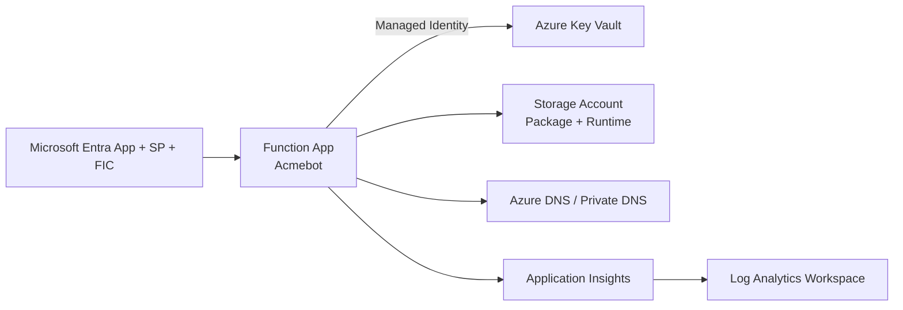

# Azure Key Vault ACME Certificate Management

Production-ready Infrastructure as Code (IaC) for deploying an ACME-based certificate automation platform on Azure using Bicep.

This solution provisions a secure Function App + Key Vault pattern (with private networking and managed identity) and deploys the latest Acmebot package automatically.

## Status

✅ **Production ready baseline**

Use `environmentType = 'prod'` and follow the checklist in [Production readiness checklist](#production-readiness-checklist) before go-live.

## What this deploys

- Azure Resource Group
- User Assigned Managed Identity
- Azure Key Vault (private endpoint)
- Azure Storage Account (private endpoints: blob/file/table/queue)
- Log Analytics Workspace
- Application Insights (workspace-based)
- Azure Functions (Linux Flex Consumption, .NET Isolated)
- Function package deployment via `onedeploy` (Acmebot from GitHub release)
- Microsoft Entra objects via Microsoft Graph Bicep extension:
  - Security group
  - App registration
  - Federated identity credential
  - Service principal
- Optional:
  - New Virtual Network + subnets
  - Private DNS zones
  - DNS role assignments (Public DNS + Private DNS)

## Architecture (high level)



## Repository layout

```text
.
├─ README.md
├─ infra/
│  ├─ main.bicep
│  ├─ param.main.bicepparam
│  ├─ Invoke-AzDeployment.ps1
│  ├─ bicepconfig.json
│  └─ modules/
│     ├─ app/site/extension/                 # oneDeploy extension module
│     └─ microsoft-graph/                    # Entra resources via Graph extension
└─ scripts/
   └─ Invoke-CertificateRenewal.ps1          # Optional host-side cert install/update helper
```

## Prerequisites

- Azure subscription with deployment permissions (`Contributor` or higher)
- Microsoft Entra permissions to create app registrations/service principals (for Graph-backed modules)
- Azure CLI (current)
- Bicep CLI (current)
- PowerShell 7+

## Quick start

Run from the `infra/` directory.

### 1) Review parameters

Update `infra/param.main.bicepparam` for your environment.

Key parameters to review first:

- `customerName`
- `environmentType` (`dev`, `acc`, `prod`)
- `location`
- `sharedResourceGroupName`
- `enableCreateVirtualNetwork` / `enableCreatePrivateDnsZones`
- `azurePublicDnsZones` / `azurePrivateDnsZones`
- `acmeContacts`
- `acmeEndpoint`

### 2) Deploy (recommended script)

```powershell
cd .\infra

.\Invoke-AzDeployment.ps1 `
  -targetScope sub `
  -subscriptionId "<subscription-guid>" `
  -customerName "bwc" `
  -environmentType "prod" `
  -location "westeurope" `
  -deploy
```

### 3) Alternative direct CLI deployment

```powershell
cd .\infra

az login
az account set --subscription "<subscription-guid>"

az deployment sub create `
  --name "kvacme-$(Get-Date -Format 'yyyyMMdd-HHmmss')" `
  --location westeurope `
  --template-file .\main.bicep `
  --parameters .\param.main.bicepparam
```

## Deployment script behavior

`infra/Invoke-AzDeployment.ps1` performs:

- Azure CLI and Bicep version checks
- User or service principal authentication
- Location short-code mapping
- Deployment GUID generation for tracking
- `what-if` confirmation flow before apply
- Subscription/tenant scoped deployment support (`tenant`, `mgmt`, `sub`)

## Production readiness checklist

Before first production rollout:

- [ ] Set `environmentType = 'prod'`
- [ ] Confirm `customerName` produces globally unique names (especially Key Vault)
- [ ] Validate VNet/subnet CIDRs do not overlap
- [ ] Confirm DNS zone IDs and target resource groups are correct
- [ ] Confirm Entra permissions for Graph-backed modules are in place
- [ ] Confirm Key Vault access policies and RBAC assignments meet your security model
- [ ] Validate private endpoint DNS resolution from your runtime network
- [ ] Validate certificate renewal window (`acmeBotRenewBeforeExpiry`)
- [ ] Run a test issuance/renewal for at least one hostname
- [ ] Enable your organization’s operational guardrails (alerts, diagnostics retention, backup/runbook processes)

## Operations and validation

After deployment:

- Confirm Function App is reachable internally through private networking
- Verify App Insights and Log Analytics ingestion
- Validate certificates appear in Key Vault and renew on schedule
- Validate DNS challenge updates succeed for your zone set

Helpful checks:

```powershell
# Latest deployment status (subscription scope)
az deployment sub list --query "[0].{name:name,state:properties.provisioningState,timestamp:properties.timestamp}" -o table

# Function app settings sanity check
az functionapp config appsettings list -g <resource-group> -n <function-app-name> -o table
```

## Optional host certificate sync script

`scripts/Invoke-CertificateRenewal.ps1` can:

- Pull certificates from Key Vault
- Install/update certificates in local machine store
- Update IIS HTTPS bindings when present

Use this script only where local certificate installation is part of your runtime topology.

## Troubleshooting

- **Permission failures**: verify Azure RBAC + Entra admin roles for Graph resources.
- **Name conflicts**: Key Vault names are globally unique.
- **Networking failures**: validate private DNS links and subnet routing.
- **DNS challenge failures**: verify role assignments and zone IDs for the managed identity.

## References

- [Azure Bicep documentation](https://learn.microsoft.com/azure/azure-resource-manager/bicep/)
- [Azure Key Vault documentation](https://learn.microsoft.com/azure/key-vault/)
- [ACME RFC 8555](https://datatracker.ietf.org/doc/html/rfc8555)
- [Acmebot project](https://github.com/polymind-inc/acmebot)
