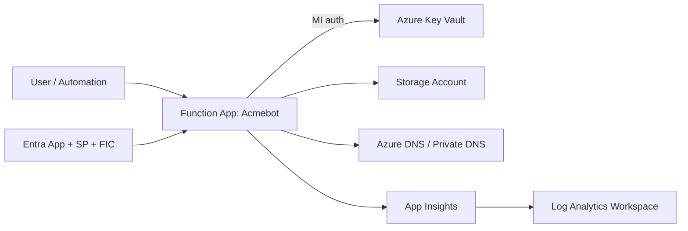

# Azure Key Vault ACME Certificate Management

Production-ready Infrastructure as Code (IaC) for deploying an ACME-based certificate automation platform on Azure using Bicep.

This solution provisions a secure Function App + Key Vault pattern (with private networking and managed identity) and deploys the latest Acmebot package automatically.

---

## Why this repo exists

This repo gives platform teams a practical, auditable baseline for:

- Secure certificate lifecycle automation at scale
- Key Vault-centric certificate storage and renewal
- Public + private DNS challenge support
- Repeatable deployment via Bicep and PowerShell

It is intentionally opinionated toward enterprise-friendly defaults (private endpoints, managed identity, monitoring, and explicit DNS RBAC).

---

## What gets deployed

- Resource Group
- User Assigned Managed Identity
- Key Vault (+ private endpoint)
- Storage Account (+ private endpoints for blob/file/table/queue)
- Log Analytics Workspace
- Application Insights (workspace-based)
- Azure Functions (Linux Flex Consumption, .NET Isolated)
- Acmebot package deployment via `onedeploy`
- Microsoft Entra resources (via Graph Bicep extension):
  - Security Group
  - App Registration
  - Federated Identity Credential
  - Service Principal
- Optional (when `enableCreateVirtualNetwork = true`):
  - Virtual Network + subnets
  - Network Security Group (associated to both subnets)
- Optional (when `enableCreatePrivateDnsZones = true`):
  - Private DNS zones
- Optional:
  - DNS role assignments for Public/Private DNS

---

## High-level architecture



---

## Project structure

```text
.
├─ README.md
├─ infra/
│  ├─ main.bicep
│  ├─ param.main.bicepparam
│  ├─ Invoke-AzDeployment.ps1
│  ├─ bicepconfig.json
│  └─ modules/
│     ├─ app/site/extension/
│     └─ microsoft-graph/
└─ scripts/
   └─ Invoke-CertificateRenewal.ps1
```

---

## Quick start

### Prerequisites

- Azure subscription permissions to deploy resources
- Microsoft Entra permissions for Graph-backed resources
- Azure CLI + Bicep CLI
- PowerShell 7+

### 1) Review `infra/param.main.bicepparam`

Key settings to validate first:

- `customerName`, `environmentType`, `location`
- `sharedResourceGroupName`
- `enableCreateVirtualNetwork`, `enableCreatePrivateDnsZones`
- `azurePublicDnsZones`, `azurePrivateDnsZones`
- `acmeContacts`
- `acmeEndpoint`
- `acmeBotRenewBeforeExpiry` (percentage of certificate lifetime remaining, 0–100, default 30)
- `acmeBotUseSystemNameServer` (default `false`, useful for private DNS resolver scenarios)
- `virtualNetworkSubnetAppService` (must be at least `/27` for Flex Consumption)

Supported ACME endpoints in this template:

- Let's Encrypt: `https://acme-v02.api.letsencrypt.org/directory`
- Buypass: `https://api.buypass.com/acme/directory`
- GlobalSign: `https://emea.acme.atlas.globalsign.com/directory`
- ZeroSSL: `https://acme.zerossl.com/v2/DV90`
- Google Trust Services: `https://dv.acme-v02.api.pki.goog/directory`
- SSL.com RSA: `https://acme.ssl.com/sslcom-dv-rsa`
- SSL.com ECC: `https://acme.ssl.com/sslcom-dv-ecc`

### 2) Deploy

Run from `infra/`:

```powershell
.\Invoke-AzDeployment.ps1 `
  -targetScope sub `
  -subscriptionId "<subscription-guid>" `
  -customerName "bwc" `
  -environmentType "prod" `
  -location "westeurope" `
  -deploy
```

The script runs a `what-if` first and prompts before applying changes.

---

## Operations checklist

After deployment:

- Enable and enforce App Service Authentication (dashboard/API)
- Verify DNS zone discovery and TXT write/delete permissions
- Issue a test certificate (prefer staging endpoint first)
- Confirm cert appears in Key Vault
- Confirm renewals and logs in Application Insights

Helpful checks:

```powershell
az deployment sub list --query "[0].{name:name,state:properties.provisioningState,timestamp:properties.timestamp}" -o table
az functionapp config appsettings list -g <resource-group> -n <function-app-name> -o table
```

---

## Security notes

- Keep DNS credentials and secrets out of source control
- Storage Account uses managed identity authentication — shared key access is disabled (`allowSharedKeyAccess: false`); no connection strings are stored or exported
- Storage Account uses infrastructure encryption (`requireInfrastructureEncryption: true`) for double-layer at-rest encryption

- For private DNS-heavy environments, consider setting `acmeBotUseSystemNameServer = true`
- Restrict dashboard/API access via Entra and app roles where appropriate

---

## Known design choices in this repo

- This repo deploys latest release asset from GitHub using `onedeploy
- DNS role assignment modules support cross-subscription scopes via explicit subscription parameters
- The baseline is tuned for Azure public cloud and Acmebot v5 behavior
- Key Vault uses Access Policies (not RBAC) to preserve compatibility with Application Gateway certificate integration
- Key Vault soft delete and purge protection are enabled with a 90-day retention period; purge protection cannot be disabled after activation
- NSG is only created when `enableCreateVirtualNetwork = true`; when using an existing VNet, NSG management is assumed to be handled by the existing network

---

## Related docs in this repository

- `infra/modules/app/site/extension/README.md`
- `infra/modules/microsoft-graph/readme.md`
- `infra/modules/microsoft-graph/*/README.md`

---

## Upstream references

- Acmebot project: https://github.com/polymind-inc/acmebot
- Acmebot docs: https://acmebot.dev/guide/
- Acmebot configuration reference: https://acmebot.dev/reference/configuration
- Azure Bicep docs: https://learn.microsoft.com/azure/azure-resource-manager/bicep/
